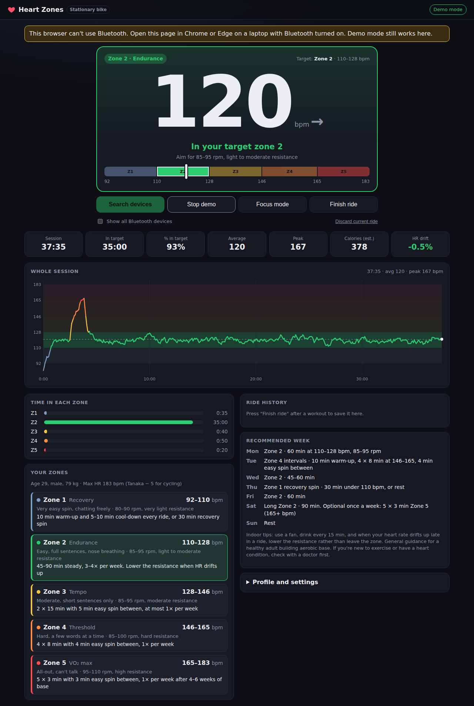

# Heart Zones



A small web app for **stationary bike** training that connects to a Bluetooth heart rate sensor (chest strap, armband, or a watch
broadcasting HR) and shows, every 5 seconds, which of the 5 heart rate zones you are in and whether you are on your target zone (zone 2 by default).

- Uses the standard Bluetooth Heart Rate service, so any sensor that pairs with Zwift, Strava, etc. works.
- **Search devices** opens Chrome's Bluetooth scanner listing nearby heart rate sensors (tick "Show all Bluetooth devices" to list everything). Devices you picked before appear under "Your devices" for one-click reconnect.
- Display refreshes every 5 s with the average of the readings in that window.
- Five zones: Z1 50–60%, Z2 60–70%, Z3 70–80%, Z4 80–90%, Z5 90–100% of max HR. Max HR comes from the Tanaka formula (208 − 0.7 × age) minus 5 bpm for cycling by default, or 220 − age − 5, or your measured max. Add a resting HR to switch to Karvonen (heart rate reserve) zones.
- "Your zones" panel shows each zone's bpm range for your profile, how it should feel, the target cadence and resistance, and a recommended indoor bike workout, plus a sample training week. Click a zone to make it the target.
- Profile defaults: age 29, male, 79 kg (editable, saved in the browser).
- Tracks session time, time and % in target, time in each zone, average HR, estimated calories (Keytel formula), and a whole-session chart with zone bands, time axis and average line.
- **Focus mode**: full-screen view with just the heart rate, trend arrow, zone and key numbers, readable from the bike.
- **HR drift**: after 30 min, compares the 2nd half of the ride to the 1st (after a 10 min warm-up). Under 5% means a solid aerobic base.
- **Ride history**: "Finish ride" saves the ride (time in target, avg, peak, drift, calories) in the browser, with CSV export. The current ride is auto-saved, so a refresh doesn't lose it.
- Keeps the screen awake, auto-reconnects if the sensor drops, optional beep when you leave the target zone.
- "Demo mode" simulates a sensor so you can try it on a PC without Bluetooth.

## Requirements

Web Bluetooth only works in **Chrome or Edge** (desktop or Android), over **HTTPS** or `localhost`.
It does not work in Firefox or Safari/iOS. Bluetooth must be on in the laptop.
Many sensors only allow one connection at a time, so close other apps using the strap.

## Run locally

```bash
npm install
npm run dev
```

## Deploy to Vercel

Option A, via GitHub: push this folder to a repo, then on vercel.com choose
**Add New → Project**, import the repo, keep the detected Vite settings, and deploy.

Option B, from the command line:

```bash
npm i -g vercel
vercel          # first time: log in and accept the defaults
vercel --prod
```

Open the `https://….vercel.app` URL in Chrome on the laptop with Bluetooth, press
**Search devices**, pick your device, and train.
